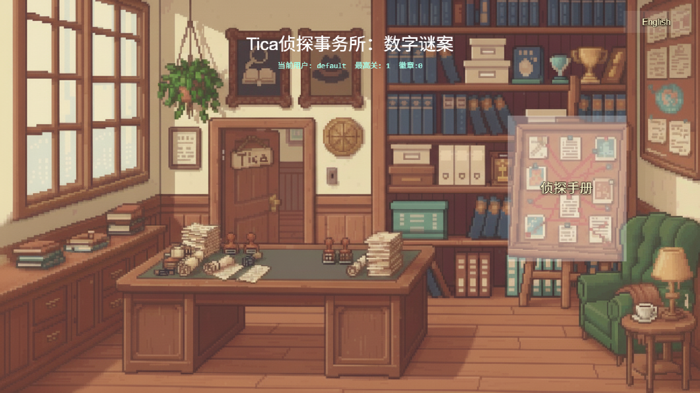

# Tica Detective Agency: Digital Mystery Cases

[](https://github.com/Carton/tica-math/releases)
[](https://opensource.org/licenses/MIT)
[](https://github.com/Carton/tica-math)

📖 [中文版 README](docs/README_cn.md) | 🎮 [Play Online](https://carton.github.io/tica-math/) | ⭐ [Give us a star!](https://github.com/Carton/tica-math/)

---

🕵️ **A detective-themed math learning game that teaches children quick calculation verification techniques through engaging detective work!**

Perfect for children aged 8-10, this game transforms mathematical learning into an exciting detective adventure where kids verify calculations using various mathematical reasoning skills.

## 🎮 Screenshots

### Main Menu & User Selection

*Choose your detective profile and jump into the world of mathematical mysteries!*

### Detective Gameplay

*Solve math cases using detective tools and verification techniques!*

**Core Educational Objective**: This game is primarily designed to teach children how to quickly verify calculations using different methods, which is the core purpose of the game. Through various mathematical verification techniques (such as digit verification, parity checking, rule of 9s, etc.), it cultivates children's mathematical thinking and calculation confidence.

**🎭 Trivia**: Tica, the protagonist detective, is named after the developer's daughter!

---

## 🌟 Key Features

### 🧠 **6 Mathematical Reasoning Skills**
- **Last Digit Tracking** - Verify calculations by checking the final digit
- **Estimation Power** - Quick approximation techniques for fast validation
- **Odd/Even Code** - Parity checking methods for calculation verification
- **Casting Out Nines** - Classic digital root technique for error detection
- **Carry/Borrow Detection** - Identify common arithmetic mistakes
- **Special Digit Fingerprint** - Advanced divisibility rules (3s, 9s, etc.)

### 🎮 **Engaging Gameplay**
- 🔧 Three detective tools: Magnifying Glass, Pocket Watch, and Lightning Bolt
- 🎯 Adaptive difficulty system with 100+ levels
- ⏱️ Time-based challenges with combo rewards
- 🏆 Comprehensive achievement system with badge collection

### 📱 **Modern Features**
- 📱 PWA support - Play offline on any device
- 👥 Multi-user profile system
- 🌐 Full internationalization (English/Chinese)
- 🎵 Dynamic audio system with sound effects and background music

## 🛠️ Technology Stack

### 🎮 **Frontend & Game Engine**
- **Phaser 3.90.0** - Modern HTML5 game framework
- **TypeScript 5.0+** - Type-safe JavaScript development
- **Vite 4.x** - Fast build tool and dev server

### 🌐 **Internationalization**
- **i18n System** - Full English/Chinese language support
- **Dynamic Language Switching** - Runtime language changes

---

## 🚀 Quick Start

### 🎮 Play Online
Visit [https://carton.github.io/tica-math/](https://carton.github.io/tica-math/) to play the game directly in your browser!

### 💻 Local Development

#### Install Dependencies
```bash
npm install
```

#### Start Development Server
```bash
npm run dev
```

### Run Tests
```bash
npm test
```

### Build Production Version
```bash
npm run build
```

## Deploy to GitHub Pages

### Automatic Deployment (Recommended)

1. Push code to the `main` or `master` branch of the GitHub repository
2. Go to repository Settings → Pages
3. Set Source to "GitHub Actions"
4. Automatic deployment will occur with each push

### Manual Deployment

If manual deployment is needed:

```bash
# Build
npm run build

# Push to gh-pages branch (need to create first)
git checkout -b gh-pages
git add dist -f
git commit -m "Deploy to GitHub Pages"
git push origin gh-pages

# Return to main branch
git checkout main
```
---

## License

MIT License


