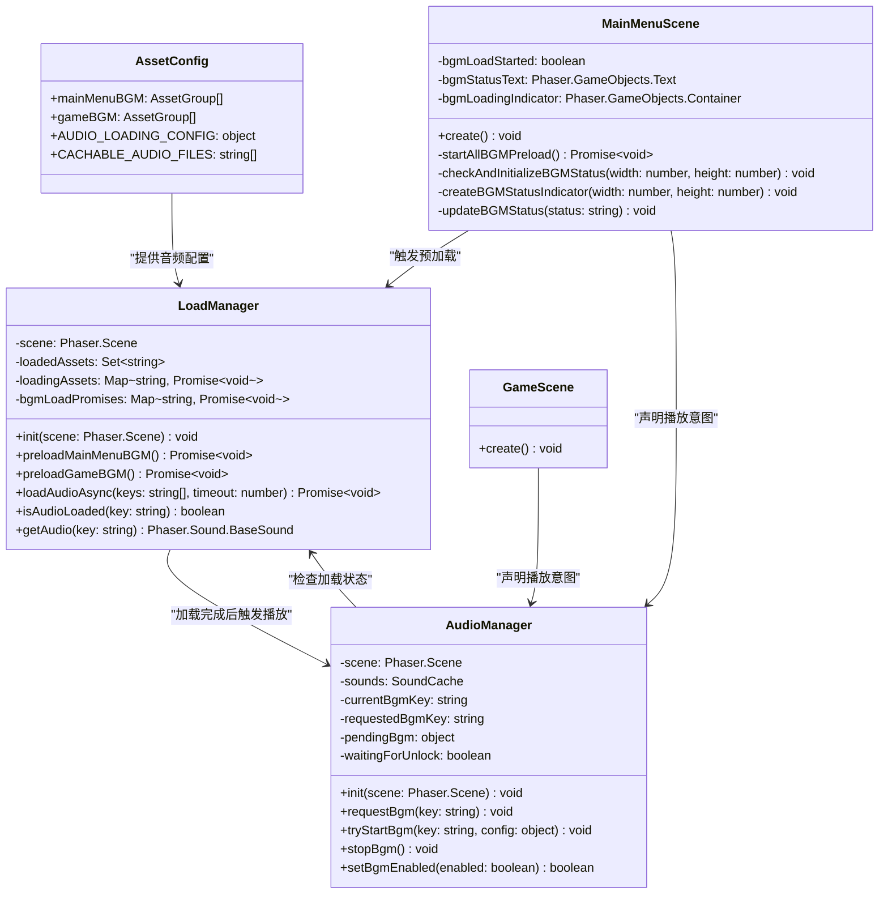
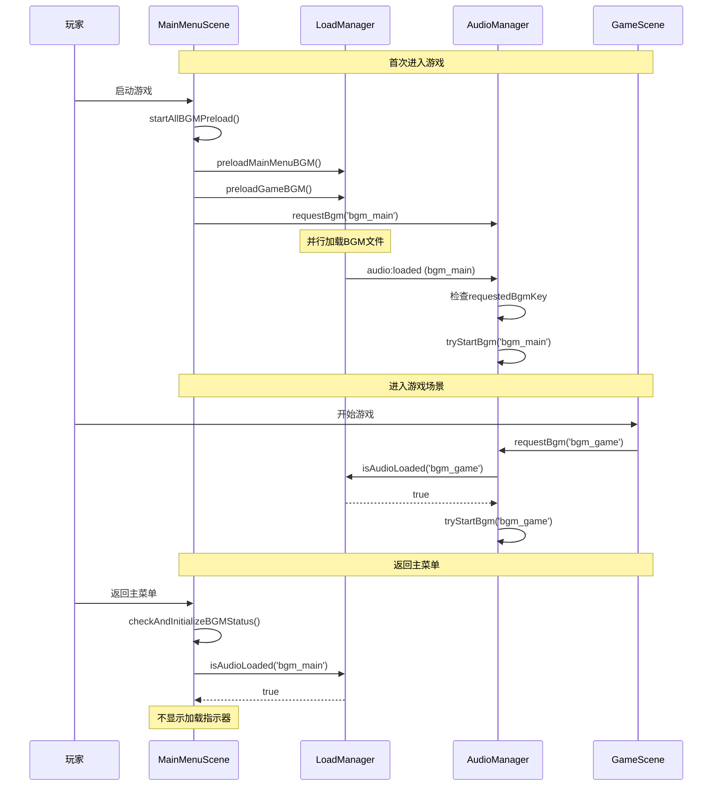

# BGM音频系统详细说明

## 概述

本文档详细说明了Tica侦探事务所游戏中的BGM（背景音乐）系统的架构、工作流程和各组件的作用。

## 系统架构

### 核心组件

BGM系统由以下主要组件构成：

1. **AssetConfig** - 音频资源配置
2. **LoadManager** - 音频资源加载管理器
3. **AudioManager** - 音频播放管理器
4. **MainMenuScene** - 主菜单场景（负责预加载）
5. **GameScene** - 游戏场景

## 类关系图



## 组件详细说明

### 1. AssetConfig (src/game/config/assetConfig.ts)

**作用**: 集中管理所有音频资源的配置信息。

**主要功能**:
- 定义BGM资源的路径和分组（主菜单BGM、游戏BGM）
- 提供音频加载超时配置
- 定义Service Worker缓存的音频文件列表

**关键配置**:
```typescript
export const AUDIO_LOADING_CONFIG = {
  bgmTimeout: 10000,      // BGM加载超时时间
  sfxTimeout: 5000,       // 音效加载超时时间
  defaultBgmVolume: 0.25, // BGM默认音量
  defaultSfxVolume: 0.6   // 音效默认音量
}
```

### 2. LoadManager (src/game/managers/LoadManager.ts)

**作用**: 负责音频资源的异步加载和状态管理。

**核心方法**:
- `preloadMainMenuBGM()`: 预加载主菜单BGM
- `preloadGameBGM()`: 预加载游戏BGM
- `loadAudioAsync()`: 异步加载单个或多个音频文件
- `isAudioLoaded()`: 检查音频是否已加载
- `getAudio()`: 获取已加载的音频对象

**工作原理**:
- 使用临时场景和临时加载器进行音频加载
- 维护加载状态缓存，避免重复加载
- 在音频加载完成后检查AudioManager的播放意图
- 通过事件系统通知加载完成

### 3. AudioManager (src/game/managers/AudioManager.ts)

**作用**: 管理音频播放和场景播放意图声明。

**核心方法**:
- `requestBgm(key: string)`: 场景声明要播放的BGM
- `tryStartBgm(key: string)`: 尝试播放指定的BGM
- `stopBgm()`: 停止当前播放的BGM
- `setBgmEnabled(enabled: boolean)`: 开关BGM

**关键属性**:
- `requestedBgmKey`: 当前场景请求播放的BGM key
- `currentBgmKey`: 当前正在播放的BGM key
- `sounds`: 音频对象缓存

**工作流程**:
1. 接收场景的BGM播放请求
2. 检查BGM是否已加载（优先使用LoadManager的状态）
3. 如果已加载立即播放，否则等待加载完成事件
4. 处理Web Audio API的解锁状态

### 4. MainMenuScene (src/game/scenes/MainMenuScene.ts)

**作用**: 主菜单场景，负责BGM预加载和状态显示。

**核心功能**:
- 在首次进入时触发所有BGM的预加载
- 声明主菜单要播放的BGM (`bgm_main`)
- 显示BGM加载状态指示器
- 处理从其他场景返回时的状态检查

**关键方法**:
- `startAllBGMPreload()`: 并行预加载所有BGM
- `checkAndInitializeBGMStatus()`: 检查BGM状态并初始化UI
- `createBGMStatusIndicator()`: 创建加载状态指示器
- `updateBGMStatus()`: 更新状态显示

### 5. GameScene (src/game/scenes/GameScene.ts)

**作用**: 游戏场景，声明游戏BGM播放意图。

**核心功能**:
- 在场景创建时声明要播放游戏BGM (`bgm_game`)
- 依赖预加载机制，无需关心加载状态

## 工作流程详解

### 完整的BGM加载和播放流程



### 场景切换时的处理

1. **首次进入主菜单**:
   - 创建BGM状态指示器
   - 开始预加载所有BGM
   - 声明播放 `bgm_main`

2. **从游戏返回主菜单**:
   - 检查 `bgm_main` 是否已加载
   - 如果已加载，不显示状态指示器
   - 重新声明播放 `bgm_main`

3. **进入游戏场景**:
   - 声明播放 `bgm_game`
   - 由于BGM已预加载，立即播放

## 设计模式和原则

### 1. 声明式设计
- 场景只需声明要播放的BGM，不关心加载细节
- AudioManager和LoadManager自动处理加载和播放

### 2. 预加载策略
- 在主菜单阶段预加载所有BGM
- 游戏场景享受零延迟切换

### 3. 状态管理
- LoadManager维护音频加载状态
- AudioManager维护播放意图
- 两者通过标准接口协作

### 4. 错误处理
- 加载超时机制
- Web Audio API解锁处理
- 重复请求防护

## 配置选项

### 音频配置 (AUDIO_LOADING_CONFIG)
- `bgmTimeout`: BGM加载超时时间（默认10秒）
- `sfxTimeout`: 音效加载超时时间（默认5秒）
- `defaultBgmVolume`: BGM默认音量（0.25）
- `defaultSfxVolume`: 音效默认音量（0.6）

### 资源配置
- 主菜单BGM: `bgm_main.ogg`
- 游戏BGM: `bgm_game.ogg`
- 音效文件: 各种游戏音效

## 性能优化

### 1. 并行加载
- 主菜单BGM和游戏BGM并行预加载
- 减少总加载时间

### 2. 状态缓存
- 避免重复加载相同的音频文件
- 加载完成后立即缓存状态

### 3. 智能检测
- 优先使用LoadManager的加载状态
- 备用使用Phaser的场景音频检测

### 4. 按需显示
- 仅在需要时显示加载状态指示器
- 从其他场景返回时智能隐藏

## 调试和日志

系统提供详细的日志输出，帮助调试：

- 🚀 预加载开始
- 🎵 场景声明播放意图
- ⏳ 等待加载完成
- ✅ 加载完成并播放
- 🔇 BGM关闭状态

## 扩展性

### 添加新BGM
1. 在 `AssetConfig` 中添加新的BGM配置
2. 在需要播放的场景中调用 `AudioManager.requestBgm()`
3. 无需修改加载逻辑，系统自动处理

### 添加新场景
1. 在场景的 `create()` 方法中声明BGM需求
2. 系统自动检查加载状态并播放
3. 可选择性地添加状态指示器

## 总结

BGM系统采用了声明式设计、预加载策略和智能状态管理，实现了：

1. **零延迟切换**: 游戏BGM已预加载，进入游戏立即播放
2. **解耦合设计**: 场景只需声明意图，不关心加载细节
3. **智能状态管理**: 自动处理各种边界情况
4. **良好的用户体验**: 优雅的加载状态指示和错误处理

这个系统为游戏提供了流畅、可靠的背景音乐体验，同时保持了代码的可维护性和扩展性。